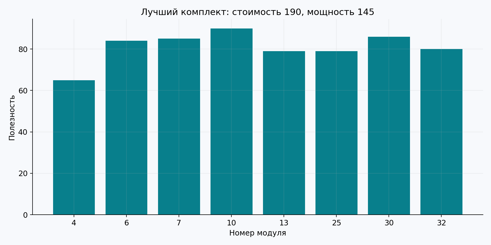
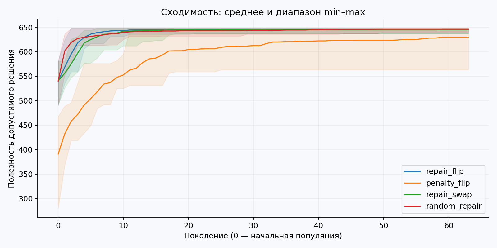
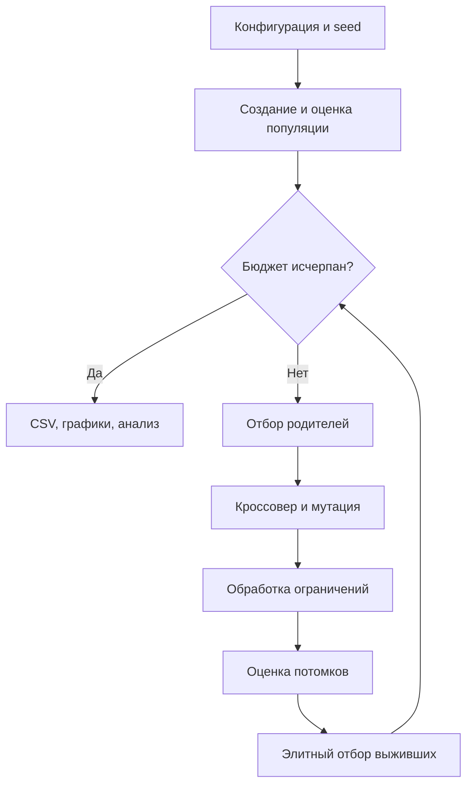

# Лабораторная работа № 2

Эволюционное программирование и генетические алгоритмы  
Группа **507**, порядковый номер **14**, год **2026**.

Индивидуализация: Q=0, Y=26; V=1+((17·14+7·0+26) mod 20)=**5**.

## Постановка и данные

Нужно выбрать комплект из 36 модулей для лаборатории. Модель синтетическая: наименования «Модуль 01» и т. п. обозначают абстрактное оборудование; это не реальные цены или характеристики рынка.

Генотип — битовая строка x∈{0,1}³⁶; фенотип — множество выбранных модулей. Максимизируется полезность Σuᵢxᵢ при Σcᵢxᵢ≤190, Σpᵢxᵢ≤150 и xₐ+xᵦ≤1 для каждой несовместимой пары (a,b). Единицы стоимости, мощности и полезности условные. Все ограничения жёсткие.

Генератор `generate` с seed=5071426 сначала создаёт 45 случайных пар и удаляет повторы, затем для каждого модуля генерирует целые стоимость [12,49], мощность [5,34], полезность [20,99]. Конкретный итоговый экземпляр сохранён в `data/equipment.json`; диапазоны и фактический список пар доступны для проверки. При повторном запуске файл читается, а не пересоздаётся.

## Алгоритм и сравнения

Популяция 64, исходная вероятность включения каждого предмета 0.22; первая особь пустая. Пустой комплект допустим и даёт стартовую нижнюю оценку 0. Турнир размера 3; равномерный кроссовер с вероятностью 0.9. Выживают 64 лучших из 128. 63 поколения плюс стартовая популяция: **4096** оценок на запуск.

- `repair_flip`: удаление менее выгодных предметов из конфликтующих пар; затем удаление по возрастанию u/(c/190+p/150), пока выполнены ресурсные ограничения. Битовая мутация с вероятностью 1/36 на бит.
- `penalty_flip`: те же кроссовер и мутация, но без ремонта. Минимизируется −полезность + K·нарушение, где K=Σu+1. Нарушение — целые превышения бюджета и мощности плюс число конфликтующих пар. Любое недопустимое решение хуже любого допустимого: минимальное нарушение равно 1, а K больше всей возможной полезности. Архив хранит только допустимые решения.
- `repair_swap`: тот же ремонт, но вместо битовых изменений выполняется один обмен двух случайных позиций. Обмен сохраняет число единиц; одинаковые биты могут оставить решение неизменным. Кроссовер и ремонт в целом это число не сохраняют.
- `random_repair`: случайные строки с вероятностью включения, выбранной для каждой строки из [0.05,0.6], затем тот же ремонт. Равный бюджет 4096. Это сильный конструктивно-случайный baseline, а не равномерная выборка из всех допустимых комплектов.

Ремонт смещает поиск к выгодным предметам: это часть алгоритма, а не бесплатная нейтральная операция. Число оценок одинаково, но стоимость обработки ограничений и время могут различаться.

## Результат и анализ

Средняя полезность: `repair_flip` — **645.30**, `penalty_flip` — **629.20**, `repair_swap` — **645.45**, `random_repair` — **646.40**. Максимум во всех четырёх сериях — **648**. Глобальная оптимальность 648 не доказана.

**ГА не превзошёл baseline.** На этом экземпляре полезный ремонт уже выполняет значительную часть поиска. Эволюционные варианты с ремонтом устойчивы, но случайная генерация с ремонтом оказалась немного лучше по среднему. Штрафной подход менее устойчив: его худший запуск дал 563. По всем оцениваемым особям допустимы в среднем 42.45% у штрафов и 100% после ремонта. Это доля оцениваемых решений, не вероятность того, что итоговый ответ допустим: итоговый архив допустим во всех запусках.

Сравнение `repair_flip` и `repair_swap` показывает малую разницу средних и противоположный порядок медиан; оснований объявлять один оператор безусловно лучшим нет. Дальнейшее исследование должно использовать несколько экземпляров данных и отделить вклад ремонта от вклада наследования.

Лучший комплект дан предметно в `results/selected_equipment.csv`, его стоимость и мощность — в `best.json`. Два допустимых примера (пустой и одиночный комплект) и два недопустимых (все модули и конфликтующая пара) с вычисленными нарушениями находятся в `constraint_examples.json`.





## Схема процесса



Оценки выживших кешируются: повторного обращения к целевой функции для них нет.
Для случайного baseline вместо отбора родителей и вариации генерируется новая выборка,
а сохраняется лучший найденный допустимый результат.


## Параметры приложенной серии

```json
{
  "population": 64,
  "generations": 63,
  "runs": 20,
  "seed": 261400,
  "data_seed": 5071426,
  "budget": 190,
  "power_limit": 150,
  "crossover_probability": 0.9,
  "mutation_probability": 0.027777777777777776
}
```

Потоки генератора: seed от 261400 до 261419 включительно.
Независимость относится к запускам на одном фиксированном экземпляре, а не к разным задачам.

## Полная сводная статистика

`std` — выборочное стандартное отклонение, ddof=1. min/max относятся к серии.
Для ошибки меньше — лучше, для полезности больше — лучше; extrema времени не являются показателями качества.

| Метод | Метрика | n | min | Среднее | Медиана | std | max |
|---|---|---|---|---|---|---|---|
| repair_flip | best | 20 | 637 | 645.3 | 646 | 3.43511 | 648 |
| repair_flip | feasible_fraction | 20 | 1 | 1 | 1 | 0 | 1 |
| repair_flip | seconds | 20 | 0.10499 | 0.117585 | 0.111489 | 0.0181792 | 0.18517 |
| repair_flip | evaluations | 20 | 4096 | 4096 | 4096 | 0 | 4096 |
| penalty_flip | best | 20 | 563 | 629.2 | 640 | 25.0591 | 648 |
| penalty_flip | feasible_fraction | 20 | 0.404297 | 0.4245 | 0.427979 | 0.0116667 | 0.440674 |
| penalty_flip | seconds | 20 | 0.0103155 | 0.0110487 | 0.0110674 | 0.000560583 | 0.0127467 |
| penalty_flip | evaluations | 20 | 4096 | 4096 | 4096 | 0 | 4096 |
| repair_swap | best | 20 | 637 | 645.45 | 644 | 2.81864 | 648 |
| repair_swap | feasible_fraction | 20 | 1 | 1 | 1 | 0 | 1 |
| repair_swap | seconds | 20 | 0.120214 | 0.130095 | 0.127658 | 0.00833898 | 0.154125 |
| repair_swap | evaluations | 20 | 4096 | 4096 | 4096 | 0 | 4096 |
| random_repair | best | 20 | 640 | 646.4 | 648 | 3.01575 | 648 |
| random_repair | feasible_fraction | 20 | 1 | 1 | 1 | 0 | 1 |
| random_repair | seconds | 20 | 0.126148 | 0.151653 | 0.141395 | 0.0248661 | 0.192419 |
| random_repair | evaluations | 20 | 4096 | 4096 | 4096 | 0 | 4096 |

## Проверка и воспроизводимость

В приложенной среде завершились полная серия и `python -m unittest discover -s tests -v`.
Протокол — `results/tests.log`. Исходные строки — `runs.csv`, промежуточные траектории —
`histories.csv`, параметры — `used_config.json`, версии — `environment.json`.
Время измерялось на общей машине с параллельно выполнявшимися независимыми экспериментами;
оно ориентировочное и не используется как основание превосходства методов.

Сравнивались средние, медианы и разбросы. Проверка статистической значимости не проводилась;
слова «лучше» в отчёте относятся к наблюдаемой серии, а не к доказанному универсальному превосходству.

